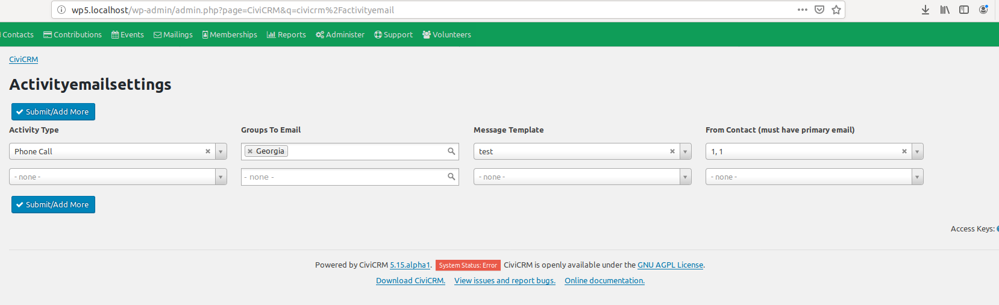

# com.aghstrategies.activityemail
Upon creation of an activity of type X, send text Y (including information from the activity) to smart group Z.

## Configuration
1. Go to the `civicrm/activityemail` settings page
  + Wordpress link: {url}/wp-admin/admin.php?page=CiviCRM&q=civicrm%2Factivityemail
  + Drupal link: {url}/civicrm/activityemail
2. Select the Activity Type and the corresponding Groups To Email, From Email Address, and Message Template. The "Submit/Add More" button will save AND add a new row to add a new Activity Type see screenshot below:

## How It Works
When an Activity is created of a type that is set up on the settings page
then a copy of that activity will be sent to each member of the corresponding `Groups To Email` field
from the `From Contact`
using the Message Template selected for that row.
Additionally, for each email sent an activity of "Email" will be created on the Contact that the email was sent to.

## Tokens Available to the Message Template
Contact Tokens for the Contact being emailed will be available to the message template as per usual. ex: {contact.first_name}

Additionally the following Activity Tokens can be used:

{$activity_type_name}  
{$activity_id}  
{$activity_source_record_id}  
{$activity_activity_type_id}  
{$activity_subject}  
{$activity_activity_date_time}  
{$activity_duration}  
{$activity_location}  
{$activity_phone_id}  
{$activity_phone_number}  
{$activity_details}  
{$activity_status_id}  
{$activity_priority_id}  
{$activity_parent_id}  
{$activity_is_test}  
{$activity_medium_id}  
{$activity_is_auto}  
{$activity_relationship_id}  
{$activity_is_current_revision}  
{$activity_original_id}  
{$activity_result}  
{$activity_is_deleted}  
{$activity_campaign_id}  
{$activity_engagement_level}  
{$activity_weight}  
{$activity_is_star}  
{$activity_created_date}  
{$activity_modified_date}  

### Example
If the settings are configured as they are in the Screenshot above then:

>**When** an Activity of type "Phone Call" is created  
>**Then** an Email will be sent to all members of the Administrator Group Primary email addresses using the Message Template "Test" from the Contact "1,1".

### Wishlist features
1. Allow multiple rows per activity type
2. Fix Message Template input field Search
